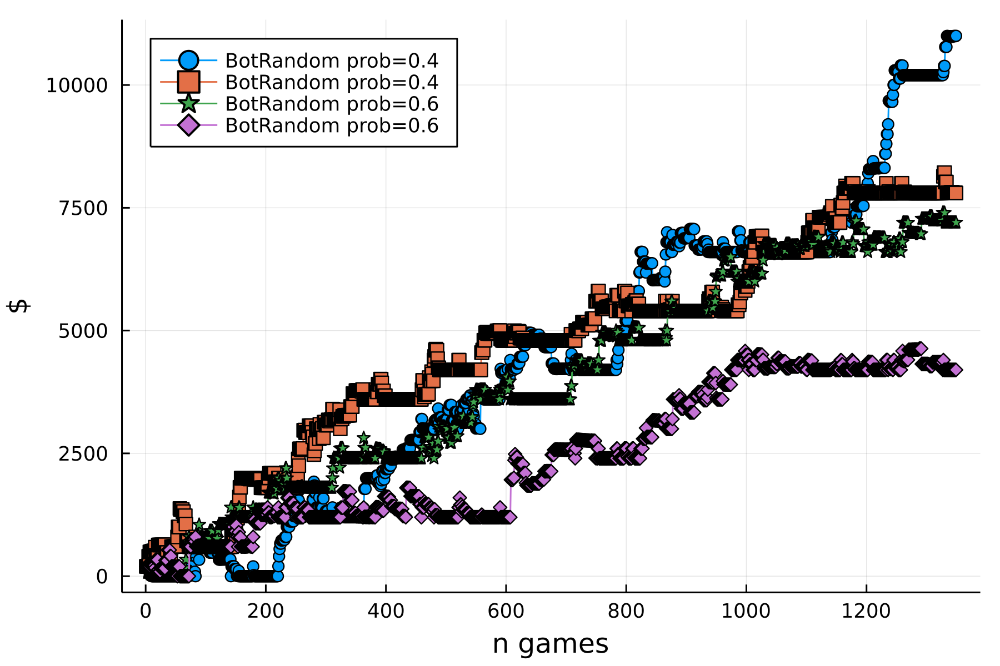
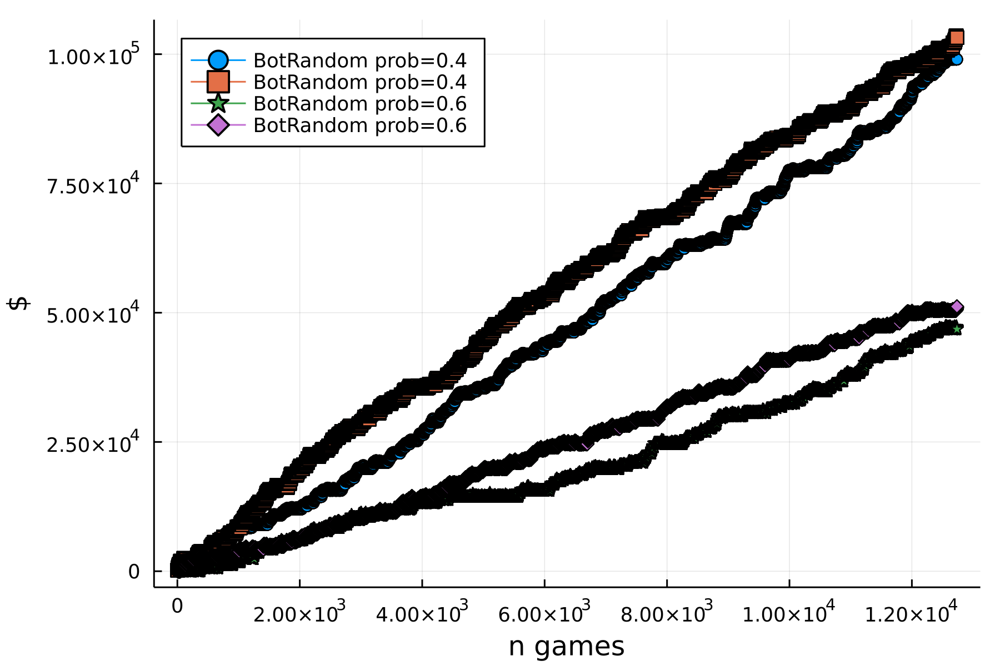

# PokerBots.jl

|||
|---------------------:|:----------------------------------------------|
| **Docs Build**       | [![docs build][docs-bld-img]][docs-bld-url]   |
| **Documentation**    | [![dev][docs-dev-img]][docs-dev-url]          |
| **GHA CI**           | [![gha ci][gha-ci-img]][gha-ci-url]           |
| **Code Coverage**    | [![codecov][codecov-img]][codecov-url]        |
| **Bors enabled**     | [![bors][bors-img]][bors-url]                 |

[docs-bld-img]: https://github.com/charleskawczynski/PokerBots.jl/workflows/Documentation/badge.svg
[docs-bld-url]: https://github.com/charleskawczynski/PokerBots.jl/actions?query=workflow%3ADocumentation

[docs-dev-img]: https://img.shields.io/badge/docs-dev-blue.svg
[docs-dev-url]: https://charleskawczynski.github.io/PokerBots.jl/dev/

[gha-ci-img]: https://github.com/charleskawczynski/PokerBots.jl/workflows/ci/badge.svg
[gha-ci-url]: https://github.com/charleskawczynski/PokerBots.jl/actions?query=workflow%3Aci

[codecov-img]: https://codecov.io/gh/charleskawczynski/PokerBots.jl/branch/main/graph/badge.svg
[codecov-url]: https://codecov.io/gh/charleskawczynski/PokerBots.jl

[bors-img]: https://bors.tech/images/badge_small.svg
[bors-url]: https://app.bors.tech/repositories/35015

An experimental package for developing poker bots

# Example

Here, we'll battle 4 bots (two `RandomBots` with `prob = 0.6`, and two with `prob = 0.5`):

<details>
  <summary>Click to expand and see the bot definitions</summary>

```julia
struct BotRandom <: AbstractAI
    prob::Float64
end
function TH.player_option!(game::Game, player::Player{BotRandom}, ::CheckRaiseFold)
    prob = TH.life_form(player).prob
    if rand() < prob; check!(game, player)
    else
        amt = Int(round(rand()*bank_roll(player), digits=0))
        amt = TH.bound_raise(game.table, player, amt) # to properly bound raise amount
        raise_to!(game, player, amt)
    end
end
function TH.player_option!(game::Game, player::Player{BotRandom}, ::CallRaiseFold)
    prob = TH.life_form(player).prob
    if rand() < 1-prob
        if rand() < prob; call!(game, player)
        else # re-raise
            amt = Int(round(rand()*bank_roll(player), digits=0))
            amt = TH.bound_raise(game.table, player, amt) # to properly bound raise amount
            raise_to!(game, player, amt)
        end
    else
        fold!(game, player)
    end
end
function TH.player_option!(game::Game, player::Player{BotRandom}, ::CallAllInFold)
    prob = TH.life_form(player).prob
    if rand() < 1-prob
        if rand() < prob; call!(game, player)
        else; raise_all_in!(game, player) # re-raise
        end
    else
        fold!(game, player)
    end
end
function TH.player_option!(game::Game, player::Player{BotRandom}, ::CallFold)
    prob = TH.life_form(player).prob
    if rand() < 1-prob; call!(game, player)
    else; fold!(game, player)
    end
end
```
</details>

Once the bots have been defined, battles can be configured in this repo as follows (see `test/runtests.jl` for the full implementation):

```julia
    n_tournaments = 50
    bots = (
        PB.BotRandom(0.4),
        PB.BotRandom(0.4),
        PB.BotRandom(0.6),
        PB.BotRandom(0.6),
    )
    @time stats, n_games = PB.battle!(n_tournaments, bots...)
    plot_stats(stats, n_games)
```

Here's the results. At 50 tournaments it's (sometimes) difficult to see which strategy is doing better



At 500 tournaments, it's clear which strategy is winning out



Note that there is variance between the two exact same strategies-- that's the "luck" of the game! But it's clear that the exact same strategies have the same asymptotic behavior.
